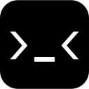

# Code-Graph-UWP

 
 In development, please stay tuned......

 

## Function description

Code Graph is a free and open source Chinese chess Code Graph game.

 

## Development environment

|Key|Value|
|:-|:-|
|System requirements| Windows 10 Fall Creators Update or upper|
|Development tool|Visual Studio 2022|
|Programing language|C#|

 

## Deployment instructions

> Download the whole project, open `Code Graph.sln`, start the project `Code Graph`, and try to see if it works.